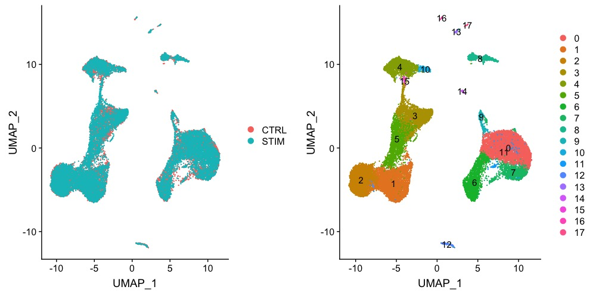
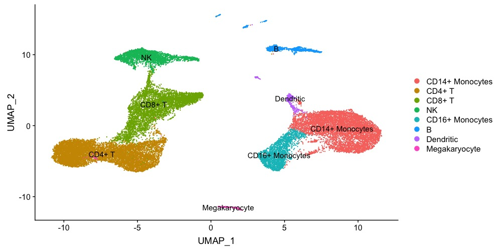
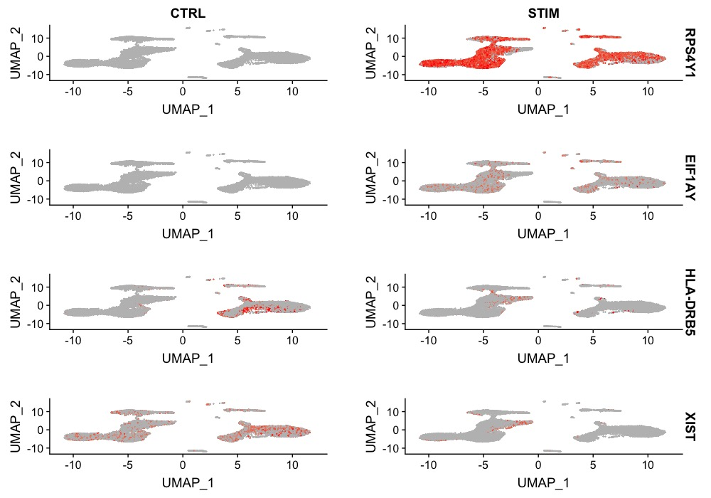
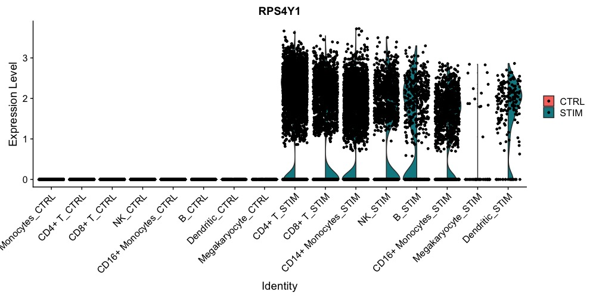

# Parkinson-Single-Cell-RNA-Seq-
## Deepanshi Shokeen, 2019 Havrda Lab, Dartmouth College 
Analyzing single-cell RNA sequencing data using Seurat Version 3.0 R toolkit to determine the differences in relative distribution of PMBC subtypes between Parkinson Disease patients and healthy controls

*Below are the some of the analysis done in the above files*

### Performed an integrated analysis

### Given names to the clusters to identify and merge the Cell Types

### Identified Differential Expressed genes across conditions 
Following is the analysis for some of genes which came out to be significantly differentiated 

We can also do analysis for particular genes

